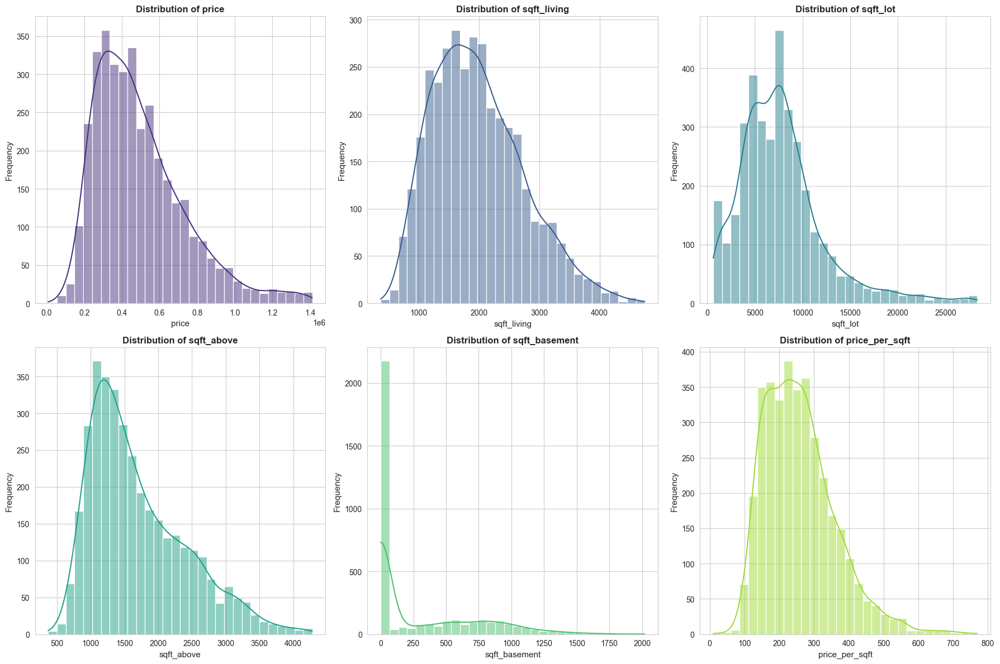
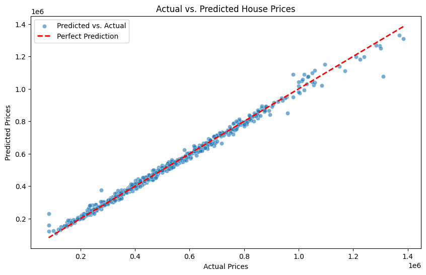
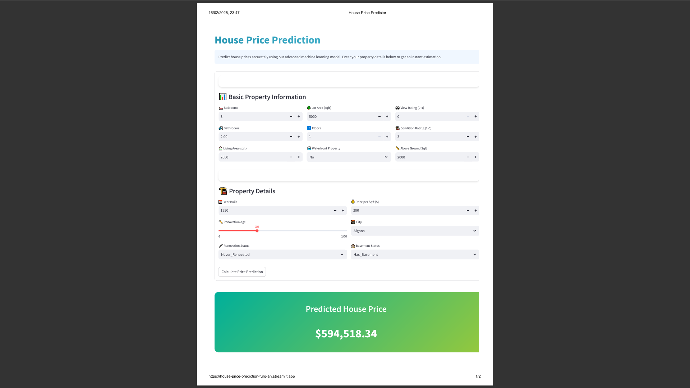
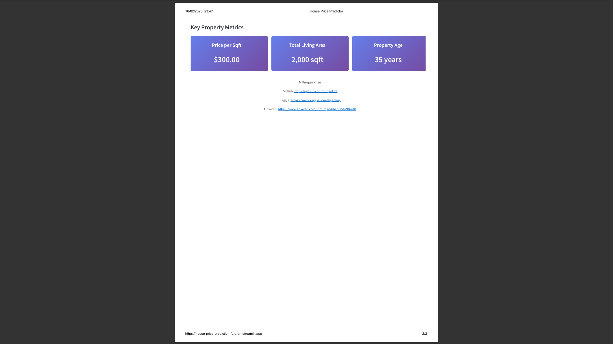

## Problem Statement  
Predicting house prices is critical for buyers, sellers, and real estate agents to make informed decisions in a competitive market. This project aims to build a machine learning model to estimate housing prices based on key features like square footage, location, number of bedrooms, and amenities.  

## Methodology  
### Data Cleaning  
- Removed outliers and handled missing values using Pandas.  
- Normalized skewed features (e.g., log transformation for price).  

### Feature Engineering  
- Created new features like "price per sqft" and "property age."  
- Encoded categorical variables (e.g., location) using One-Hot Encoding.  

### Model Training  
- Trained  regression model (Random Forest).  
- Optimized hyperparameters using GridSearchCV (Scikit-learn).  

## Results  
### Feature Importance  
  
*The top  drivers of house prices are square footage, location,price per sqft, and number of bedrooms.* 

### Actual vs. Predicted Prices  


## How to Run  
1. **Clone the repository**:  
   ```bash  
   git clone https://github.com/furqank73/House-Price-Prediction.git  

## Live Demo  
Try the interactive app to predict house prices:  
[](https://house-price-prediction-furq-an.streamlit.app/) 

## App Interface  
### Prediction Page  
  

### Key Metrics & Contact  
  